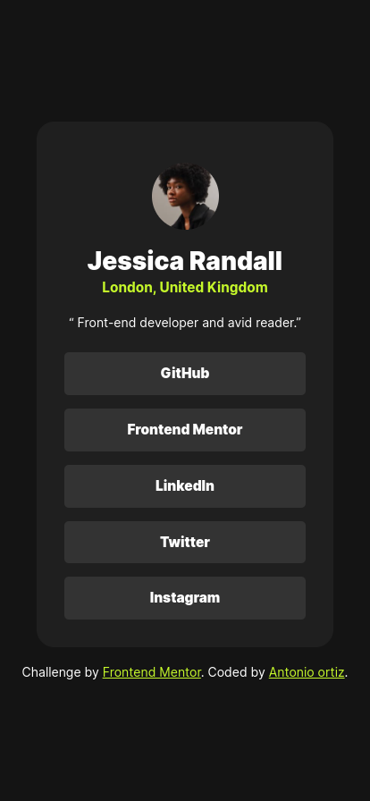

# Frontend Mentor - Social links profile solution

This is a solution to the [Social links profile challenge on Frontend Mentor](https://www.frontendmentor.io/challenges/social-links-profile-UG32l9m6dQ). Frontend Mentor challenges help you improve your coding skills by building realistic projects.

## Table of contents

- [Overview](#overview)
  - [The challenge](#the-challenge)
  - [Screenshot](#screenshot)
  - [Links](#links)
- [My process](#my-process)
  - [Built with](#built-with)
  - [What I learned](#what-i-learned)
- [Acknowledgments](#acknowledgments)

## Overview

### The challenge

Users should be able to:

- See hover and focus states for all interactive elements on the page

### Screenshot

### Links

- Solution URL: [Add solution URL here](https://github.com/ortiz-antonio/FM-slp)
- Live Site URL: [Add live site URL here](https://ortiz-antonio.github.io/FM-slp/)

## My process

### Built with

- Semantic HTML5 markup
- CSS Variables
- Flexbox
- Mobile-first workflow
- [Normalize.css](https://necolas.github.io/normalize.css/) - CSS Library

### What I learned

I practiced Responsive Web Design more

## Author

- Website - [Antonio Ortiz](https://ortiz.studio)
- Frontend Mentor - [@ortiz-antonio](https://www.frontendmentor.io/profile/ortiz-antonio)
